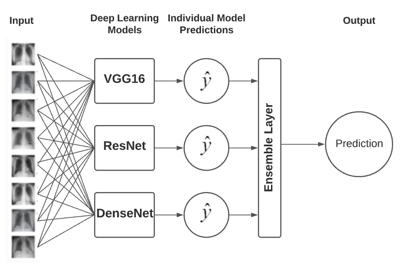

# Deep Learning Ensemble Model for COVID-19 Detection 
#### Submitted in partial fulfilment of the requirements for the degree of MSc. at University of York

This repository contains a deep learning ensemble model consisting of three pre-trained deep learning models and a pre-trained meta-learner.
The ensemble can be used to classify an X-ray image as belonging to a patient with COVID-19, non-COVID-19,
pneumonia, or with neither of these symptoms (Normal). The premise was to further improve the accuracy of individual deep learning models on COVID-19 detection by combining into an ensemble.



## Usage
Run from command-line with folder containing x-ray images as input
```bash
$  python3 -m ensemble_app test_images/covid-19
```

## Abstract
In 2019 the coronavirus COVID-19 spread rapidly around the world causing devastating disruption to daily life, and healthcare systems. A critical step in mitigating the virus was to quickly and accurately detect infected patients. Using convolutional neural networks (CNNs) with radiology findings can provide an additional method to diagnose sick patients with fast turnarounds. 
The aim of the research was to evaluate whether ensemble deep learning models, models that harness the prediction of multiple CNNs, could provide more accurate  COVID-19 detection than individual deep learning models. To do this, a deep learning ensemble model pipeline was constructed. A dataset was collected consisting of 4172 chest X-ray images of patients. The X-rays were anonymized to protect the patients’ privacy. The images were then used to train three CNNs. The trained CNNs were then used to assemble deep learning ensemble models which were then evaluated on correctly predicting the classes of the images. All four ensemble models achieved higher accuracy than the three base CNN models. The Logistic Regression (LR) stacked ensemble model was found to be the most accurate achieving an accuracy of 83.33% at 3-class classification surpassing the top base model by 1.74%. The SVM stacked model had the highest COVID-19 accuracy at 95.36%. The results suggest that ensemble models can be used to further improve deep learning model accuracy at COVID-19 detection and assist clinicians in making appropriate decisions for COVID-19 detection. While the proposed LR stacked model yielded promising results, it could further be improved by sourcing more X-rays of pneumonia patients and integrating other pre-trained deep learning models into the pipeline. 


